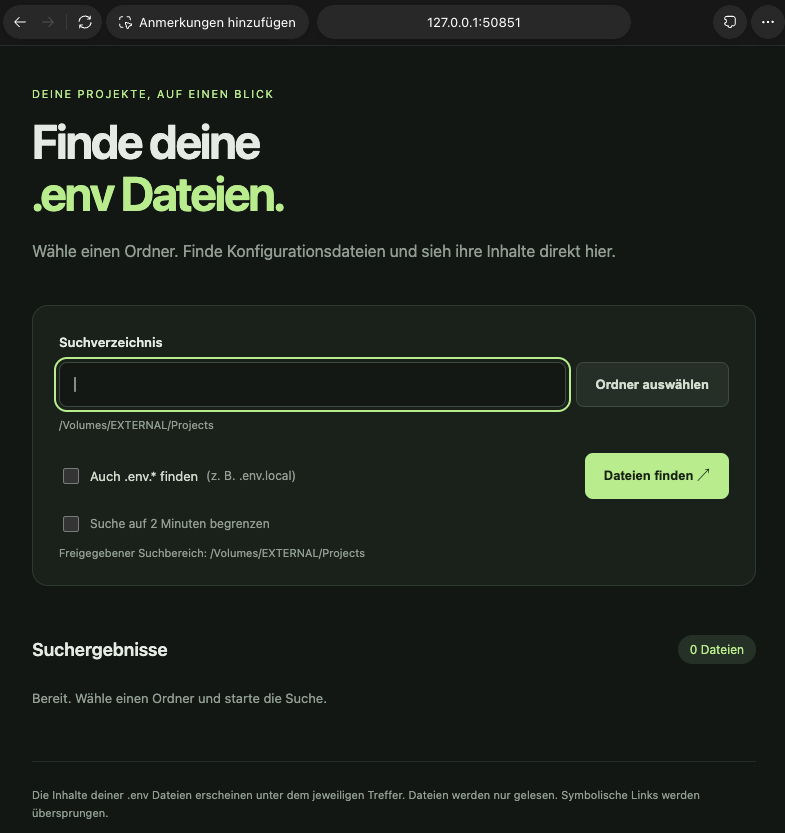

# Env Finder

A local Flask app that finds `.env` files recursively and displays their contents in a browser. Choose a folder, optionally include `.env.*` files, and copy file paths. Files are opened read-only.

## Demo



## Install and configure

Requirements: **Python 3.12**. For Docker mode, also install and start Docker Desktop or Docker Engine. The commands below work on macOS and Linux.

Download or clone the project, then open a terminal in its directory. Create the configuration if it does not already exist:

```sh
test -f .env || cp .env.example .env
```

Edit `.env` and set an existing folder:

```dotenv
DEFAULT_SEARCH_FOLDER=/path/to/your/projects
```

The example path is a placeholder. `.env` is ignored by Git; `.env.example` is the shared template.

An environment variable `DEFAULT_SEARCH_FOLDER` overrides the file; `--root` overrides both. Relative paths in the configuration refer to the project directory. Restart the app after changing its configuration.

## Run locally

```sh
python3.12 start.py --local
```

This creates a Python 3.12 `.venv`, installs the dependencies, and starts the app. Press **Ctrl+C** to stop it.

## Run with Docker

```sh
python3.12 start.py --docker -d
```

This builds the image and starts a background container with the configured folder mounted read-only. The terminal prints the container name and stop command:

```sh
docker stop CONTAINER_NAME
```

Replace `CONTAINER_NAME` with the printed name. Each launch creates a new container; stop the previous one before starting another. After changing `.env`, recreate the container to use the new folder.

## Use the app

Open the URL printed in the terminal. Port **5000** is preferred; a free port is selected automatically if it is occupied.

Click **Ordner auswählen** to choose a folder within the configured search area, then **Dateien finden**. File contents appear beneath each result and can be collapsed. Large searches may take several minutes; an optional checkbox limits the search to two minutes.

To use another search area for one launch:

```sh
python3.12 start.py --local --root /path/to/another/folder
```

Content display is limited to 1 MiB per file. Symbolic links are skipped, and any incomplete results or read errors are identified in the interface.

## Tests

After installing the local dependencies:

```sh
.venv/bin/python -m unittest discover -s tests -v
```

See `SPEC.md` for the specification and `CLAUDE.md` for the project prompt history.

## License

Licensed under the [MIT License](LICENSE).
